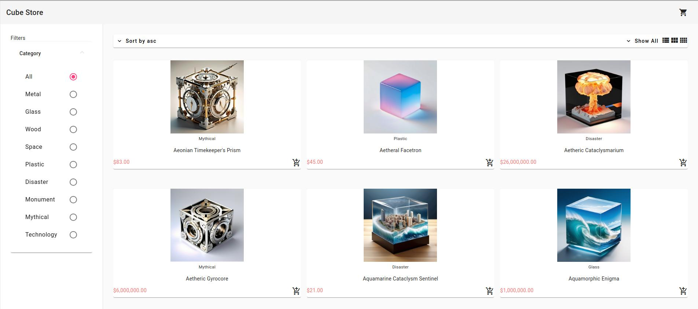
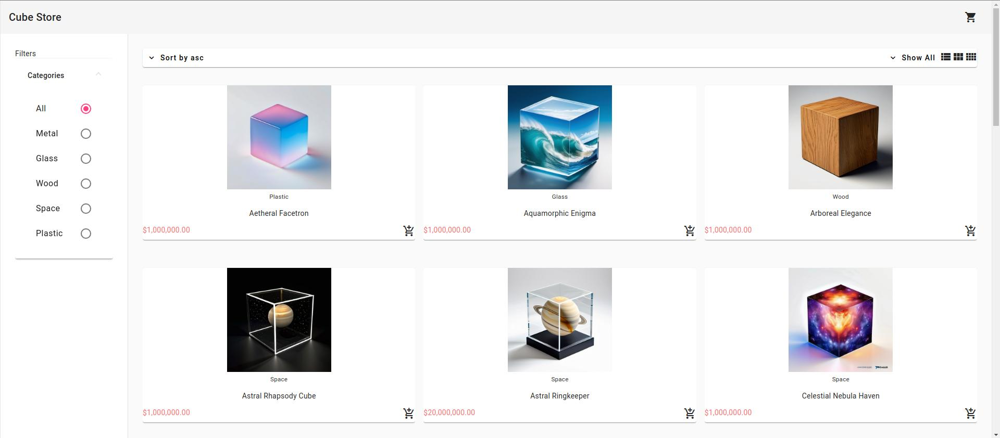

# About this App
Cube Store App lets you choose from a wide assortment of hand-picked artisan cubes!

## Link to Site

- http://18.118.238.40:4200
    - hosted on AWS(Amazon Web Services) on t2.micro ec2 instance. 
    <strike>
    - WARNING: images load extremely slowly because the images are sent to frontend from backend encoded in base64 and as a result, the json file is large. I'll create a loading animation to play while the images are getting fetched from the backend api. 
    </strike>
        - fixed on 2024/1/24

## Architecture:
- Angular as front-end using Tailwind CSS and Material Framework components
- Node as back-end api to retrieve cubes and proceed to checkout
    - REST api
- Stripe for payment handling
    - implementation in stripe docs: https://stripe.com/docs/payments/during-payment/charge-shipping?payment-ui=checkout

## Features:
- Sort cubes by categories
- Can also sort by ascending/descending order, load 12,24, or 36 cubes, and change viewing style
- Add cubes to cart and change quantity in cart page
- Checkout and pay for cubes

# Website Versions:

### V2 - 2024/01/06


### V1 - 2024/01/05



## Works Cited
- Inspiration from: https://www.youtube.com/watch?v=Kbauf9IgsC4&t=265s

# Updates

## 2024/02/19
- Got feedback from friend that the description was hard to read in mobile view because it was just a giant block of text. This made me realize that the UI for the cube cards was pretty bad, so I made the cube title larger and the font a bit bolder. I lowered the opacity of the category and size. I also split up the description into 2 paragraphs so it looks a bit better.
    - split it up by using .split('  ') so that the description gets split into an array with 2 elemnents, first has the text before the doubles spaces, and the second element as the text after the double spaces.
- Change the appearance of the scrollbar to make it more aesthetic
    - went into the styles.css file and made changes to the scrollbar classes
- added margin to the left and right of the grid-list so that the words don't look stretched out on a large screen(1280px minimum)
- added extra description text to the Wooden Crate cube
- probably need to add some styling to the filters and align the dollar sign in the price filter.
- site looks a lot better with just some UI changes, especially the thin scrollbars; they make it feel aesthetic and professional
- change the "age" of cube to a number in json file instead of string(was previously a number surrounded by double quotes)
    - I should really move these cubes to a NoSQL database like MongoDB to get some experience with that.
    - Also need to overhaul this backend and use MVC model with a controller and services
- Deploy these UI changes to AWS
- Remove left and rigth padding from the mat-toolbar element by changing styles.css
    - learned something new today, the "!important" part lets this styling override any other styling declared elsewhere, like the base angular material css styles. The padding doesn't go away without the "!important" part
    ```
    .mat-toolbar {
        padding-left: 0 !important;
        padding-right: 0 !important;
    }
    ```

## 2024/02/17
- got the website to be mobile responsive. It's a bit janky but still pretty good, all things considered. I need to fix the price sorting so that it gives an error when the max price is less than the min price
- add {useHash: true} to imports in app-routing.modules so that nginx doesn't give a 404 error when you refresh the page in the deployed app
    - @NgModule({
        imports: [RouterModule.forRoot(routes, {useHash: true})],
        exports: [RouterModule]
        })
- deployed new version of the app to AWS with 2 new filters, fixed refresh error, implemented lazy loading, and added mobile responsiveness

## 2024/02/11
- Implemented drawer closing and opening on button click in mobile mode.
- Did this with a drawer service that tracks whether the device is a mobile device and toggles the drawer's state.
- Making the app mobile-friendly is more annoying than I thought. I think I need to change the row height things from a set height to a max-height thing and have the cards expand automatically to fit that. Turning the screen from vertical to horizontal also closes the mat-drawer for some reason and this messes up the button because it expects the filters drawer to be open, but maybe there's a way to detect this and update the drawer service accordingly.
- Having the images scale properly is the most annoying part and after this, I'll have to fix the cart view too.

## 2024/02/07
- Implemented error handling for price sort with mat-error.
- Used the email example in the Angular Material UI to help as ChatGPT's code was weird and didn't work. I didn't need a form, just the formControl for each input.
- Need to make a custom validator that makes the minimum and maximum price rely on each other. I want to have an error message that shows when the minimum price is greater than the maximum price, and when the maximum price is less than the minimum price (same case?).
- Added cube SVG logo that looks too big but feels good compared to a smaller size: might change this later.

## 2024/02/05
- Implemented sorting by minimum and maximum size.
- Price was set as a string in the JSON file ("price": "21" instead of "price": 21), so after changing this, the filter for price worked fine.

## 2024/02/04
- Implemented sorting by size.

## 2024/02/01
- Fixed stripe checkout in AWS VM.
    - The API call was still pointing to localhost instead of the IP address of VM.
- Added docker-compose.yml file to AWS VM for easier setup of docker containers.
    - Added to repository for version control and for future.

## 2024/01/24
- Statically served all images with the Node.js server in localhost.
- Website loads images much, much faster and feels extremely responsive when changing categories.
    - Will implement lazy loading in images so that the images are loaded even faster.
- Will implement in the AWS server as well, just need to change localhost to the IP address of the AWS VM.
- Website is up and images load almost instantaneously, much better QoL and feel.

## 2024/01/14
- Renamed repository to "cube-store-application".
- Lowered more prices on cubes (they were in the millions and billions) because Stripe has a cap on how much money can be in checkout.

## 2024/01/10
- Hosted website on AWS (Amazon Web Services) t2.micro EC2 instance.
    - Initial thoughts are that this t2.micro instance handles loads much better than GCP's e2.micro, but will have to see after I implement a database for the images instead of just a .json file.

## 2024/01/09
- Implemented Docker images of Angular front-end and Node back-end server and had them successfully run in localhost.
    - Docker container start-up code for front-end: `docker run -d -p 4200:80 cube-store:frontend-v1`.
    - Docker container start-up code for back-end: `docker run -d -p 4242:4242 cube-store:backend-v1`.

## 2024/01/08
- Made Docker images of Angular front-end and Node back-end server and had them successfully run in localhost.
    - Docker container start-up code for front-end: `docker run -d -p 4200:80 cube-store:frontend-v1`.
    - Docker container start-up code for back-end: `docker run -d -p 4242:4242 cube-store:backend-v1`.

## 2024/01/07
- Added some of the generated cubes to cube-details.json file.

## 2024/01/06
- Generated 25 more cubes, will probably not use all.

## 2024/01/05
- Successfully showed images of cubes on frontend.
- Did this by encoding images present in the backend to base64, writing it to the JSON file, and decoding it in the frontend.
    - Code to create the base64 encoded string from local image path is in server.js file.
- Generated titles and descriptions of 24 cubes using ChatGPT.
    - Prompt blueprint: Generate a cool, fantasy name (without cube, prism, or nexus in it) and short, descriptive fantasy description for a [category] cube [describe the image].
    - I included the "without cube, prism, or nexus" part in the prompt because the names were getting repetitive and it generated unique names after that.
    - Example prompt: Generate a cool, fantasy name (without cube, prism, or nexus in it) and short, descriptive fantasy description for a glass cube containing a snow-capped mountain situated on an island with a lush forest surrounding its base.
- Ideas for more cubes:
    - Natural Disasters: tornado, volcano, tsunami, earthquake, lightning (this would be cool).
    - Man-Made Structures: house, mansion, monuments, statues.
    - Machine/Technological: Circuitry, electrical, buttons?, tiled/grid?
    - Fantasy/Mythical: runes, bloodmarks, inscriptions of prayer, hieroglyphics?, cave man paintings.
    - Hollow: Has holes in the center of each side with something inside; shiny sphere in the center?, Maybe Static Electricity Ball.
    - Biological: brain in formaldehyde, Mini Dragons, an imposing eyeball.
    - Infinite/Repeating: fractal cube, abstract art, "infinite 3d cube" on google.
- Let back-end handle any and all changes the user makes to category, sort, and limit.
    - Does this with a GET request with multiple request queries (sort and limit) and one request parameter (category).

## 2024/01/04
- Learned that Angular only accepts/loads static items such as images if they're present in the "assets" folder.

## 2024/01/02
- Generated a variety of cubes with stable diffusion (might create more cubes/redo old ones using controlNet).
    - Stable diffusion setup: https://www.youtube.com/watch?v=nBpD-RbglPw.

## 2023/12/31
- Cube store works with fakestoreapi and Stripe checkout (images won't show in stripe checkout, but will deal with it later).
- Goal is to replace fakestoreapi with own API that has different cubes with images generated with stable diffusion.
- Also need different categories that match with these cubes.
    - Material: All, Metal, Plastic, Wood, Glass, Paper.
    - Size: All, Small, Medium, Large.
    - Cost maybe?: All, Cheap, Normal, Expensive, Custom.
    - Age: All, <100yrs, 100-1000yrs, >1000yrs