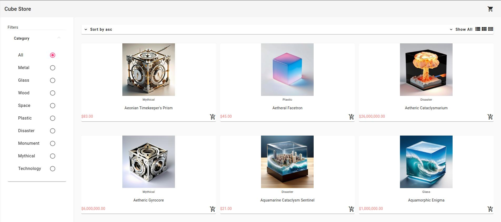

# CubeMint

CubeMint is a full-stack commerce platform for browsing, filtering, wishlisting, and purchasing a catalogue of AI-generated artisan cubes. It combines an Angular storefront with an Express API, MongoDB persistence, Stripe Checkout, image processing, authentication, and Docker packaging.

> **Project status:** The source and local architecture are available for review. The former AWS deployment is offline, so this repository does not claim a live public demo.



[Technical overview](https://pesanth.com/work/cubemint) · [Portfolio](https://pesanth.com)

## What this project demonstrates

- Responsive product discovery with category, size, price, sort, pagination, and display controls.
- Cart, wishlist, quantity-management, and Stripe-hosted checkout workflows.
- An Express REST API backed by MongoDB and Mongoose.
- Administrative product and image workflows protected by JWT authentication.
- Separate frontend and backend containers coordinated with Docker Compose.

## Architecture

```text
Browser
  |
  v
Angular storefront (port 4200)
  |
  | REST / JSON
  v
Express API (port 4242)
  |                |
  v                v
MongoDB        Stripe Checkout
```

The frontend reads its API base URL from a runtime-generated `env.js` file. The backend handles catalogue queries, authentication, image uploads, and checkout-session creation. Product metadata is stored in MongoDB while uploaded images are served from a persistent volume.

## Repository layout

```text
web-store/
  src/                 Angular application
  server/              Express API and data access
  Dockerfile           Frontend build and Nginx runtime
  docker-compose.yml   Frontend/backend orchestration
images/                Version screenshots
```

## Run locally

Prerequisites: Docker, a reachable MongoDB instance, and Stripe test credentials.

1. Copy `web-store/backend.env.example` to `web-store/backend.env` and replace every placeholder.
2. From `web-store`, set `API_URL` to the backend URL used by the browser.
3. Start the published containers:

```bash
docker compose up
```

The storefront is exposed on `http://localhost:4200` and the API on `http://localhost:4242`.

For frontend development, run `npm install` and `npm start` from `web-store`. For API development, run the same commands from `web-store/server`.

## Verification and limitations

- The portfolio review verified a MongoDB-backed catalogue response containing 66 products and captured desktop and mobile evidence.
- The repository does not currently include an automated test suite.
- Stripe should be used only in test mode until a production security, error-handling, and payment-flow review is complete.

## License

Licensed under the [MIT License](./LICENSE).
